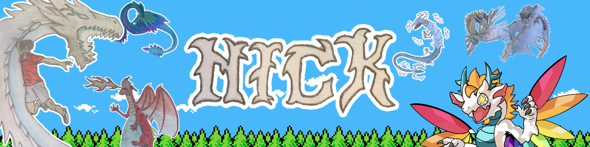

## Hi I'm Nick, a SYDE student @ UW and a developer interested in game dev. 🎮

I'm currently learning Unity and C#. I just finished my first game FlappyLumie. 🐉

I'm currently working on a 2D platformer for my final project in Engineering prototyping. 

If you want to find me you can @:

- **Instagram:** [@leaping_river_fish](https://instagram.com/leaping_river_fish)
- **LinkedIn:** [zheng-nick1](https://www.linkedin.com/in/zheng-nick1/)
- **Website:** [asklumie.me](https://asklumie.me)
- **Occasionally:** volleyball / badminton drop-ins

